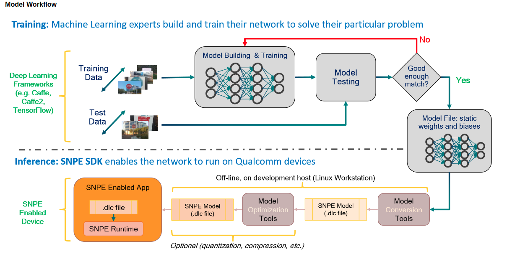
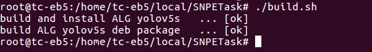
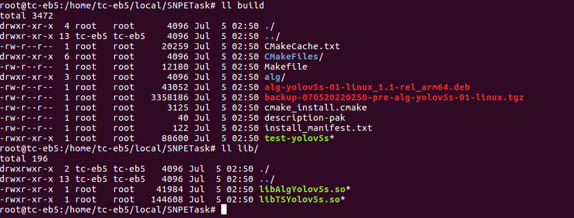
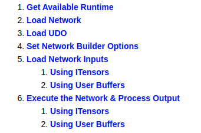
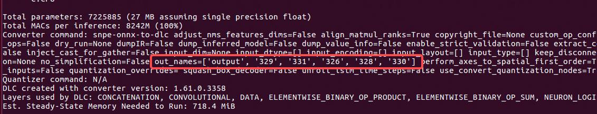
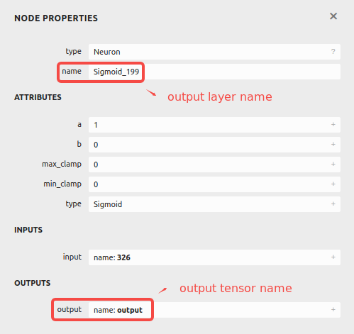
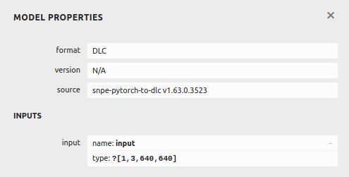
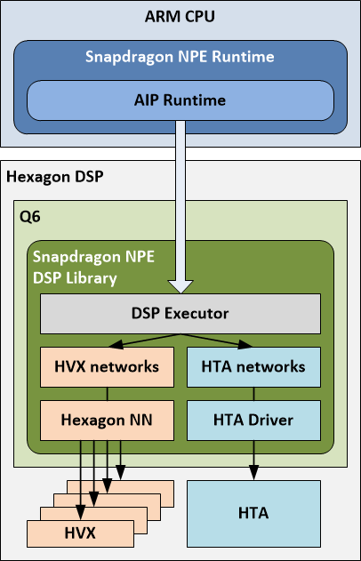
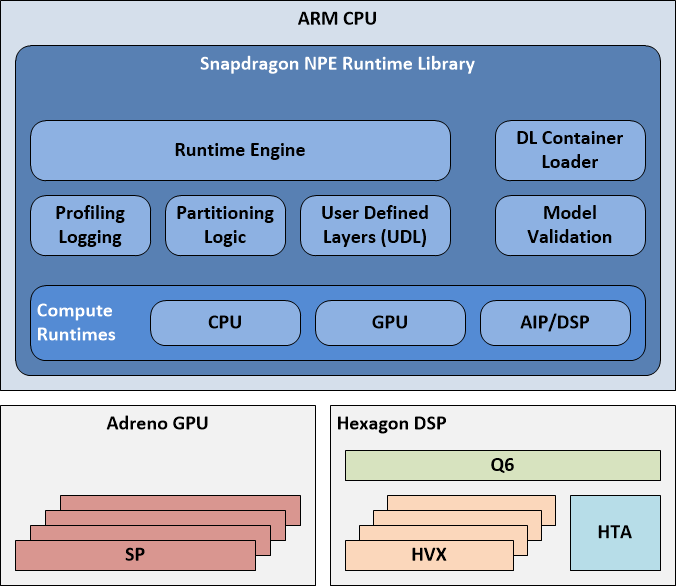

# SNPETask

[TOC]

## Overview



上图源自Snapdragon Neural Processing Engine SDK Reference Guide，它展示了一个Deep Learning Neural Network在SNPE环境下的Workflow。本repo主要关注Workflow中的第二个阶段，当你拥有一个预训练模型（以`yolov5s.onnx`为例），如何从Model Convert到SNPE Enabled App，如官方教程所言，主要有以下四个步骤：

- 把`.tf/.tflite/.onnx/caffe/caffe2/.pt`等网络预训练模型转换为一个能够被SNPE加载的DLC文件。

- 量化模型，以便能在Hexagon DSP上运行（可选项）。 

- 准备模型需要的输入数据。 

- 使用SNPE runtime加载并运行模型。

## File Tree

```shell
ts@ts-OptiPlex-7070:~/workSpace/SNPETask$ tree
.
├── alg								# AIRunner ALG封装源码
│   ├── AlgYolov5.cpp
│   ├── AlgYolov5.h
│   ├── CMakeLists.txt
│   ├── Common.h
│   └── objectdetection.json
├── CMakeLists.txt
├── build.sh						# build脚本
├── inc								# YOLOV5 SDK头文件
│   ├── TSYolov5s.h
│   └── TSYolov5sImpl.h
├── lib
│   ├── libAlgYolov5s.so			# AIRunner 显示调用库
│   └── libTSYolov5s.so				# YOLOV5 SDK
├── LICENSE
├── model
│   ├── labels.txt					# YOLOV5 Class Labels
│   └── yolov5s.dlc					# YOLOV5 DLC File
├── README.md
├── snpetask						# SNPE Inference SDK源码
│   ├── SNPETask.cpp
│   └── SNPETask.h
├── src								# YOLOV5 SDK源码
│   ├── TSYolov5s.cpp
│   └── TSYolov5sImpl.cpp
├── test							# 测试程序源码
│   ├── labels.txt
│   ├── main.cpp
│   ├── orange.jpeg
│   └── people.jpg
└── utility							# Image Buffer Manager源码
    ├── imgbuf.cpp
    ├── imgbuf.hpp
    ├── TSImgData.cpp
    └── TSStruct.h
```

## Prerequisites

- 开发平台：Qualcomm® QRB5165 (Linux-Ubuntu 18.04)
- 图形界面：Weston(Wayland)
- 开发框架：Gstreamer-1.14.5，OpenCV-4.5.5
- 算法引擎：snpe-1.61.0.3358
- 算法示例模型：YoloV5s
- 第三方库：gflags，json-glib-1.0，glib-2.0
- 构建工具：CMake-3.10.2
- 打包工具：checkinstall-1.6.2

```shell
# SNPE Runtime Library需要用户从官方链接下载并放到开发板指定目录
# cmake/OpenCV需要用户编译安装
# yolov5s.onnx预训练模型可以从官方repo获取
# third-party dependencies可以使用apt-get install安装
sudo apt-get install libjson-glib-dev libgflags-dev
```

## Build & Compile & Run

项目使用`CMakeLists.txt`进行构建和包管理，并提供了`build.sh`脚本用于构建整个项目（包含`alg`），运行成功将输出如下log：



假如编译失败则会输出[failed]，并且deb package也会生成失败。

`build`目录下将包含如下信息，相关.so文件被重定向到`${CMAKE_SOURCE_DIR}/lib`目录：



其中`test-yolov5`为测试程序，`alg-tymx-01-linux_1.1-rel_arm64.deb`为`checkinstall`追踪make install生成的deb安装包。

`alg-tymx-01-linux_1.0-rel_arm64.deb`可以直接使用`dpkg - i`命令安装，内涵YOLOV5S SDK和AIRunner ALG两部分内容，均被安装至`/opt/thundersoft/`目录下，详细安装路径可以阅读`CMakeLists.txt`中的install语句。

### Run Test Program

测试程序`test-yolov5`使用gflags库进行命令行参数解析，可配置的参数及默认值如下：

```shell
  Flags from /home/tc-eb5/local/jiayang/test/main.cpp:
    -confidence (Confidence Threshold.) type: double default: 0.5
    -device (DLC runtime device.) type: string default: "CPU"
    -input (Input image file for this test program.) type: string
      default: "./image.jpg"
    -labels (Labels file for the yolov5s model.) type: string
      default: "./labels.txt"
    -model_path (DLC file path.) type: string default: "./yolov5s.dlc"
    -nms (NMS Threshold.) type: double default: 0.5
```

测试程序将根据用户运行参数来初始化YOLOV5S Inference SDK对象并对输入图像进行推理，以下是在`build`目录下的一个运行样例：

```shell
./test-yolov5 --input ../test/tymx.jpg --labels ../test/tymx_labels.txt --model_path ../model/tymx_onnx.dlc --nms 0.45 --confidence 0.25
```

上述命令以`test`目录下的`tymx.jpg`为待检测图片，使用`test`目录下的`tyme_labels.txt`作为模型类别输入，`model`目录下的`tymx_onnx.dlc`作为推理的预训练模型，并设置nms阈值为0.45，检测置信度为0.25。

## Model Conversion

模型转换本身并不复杂，因为模型本身只代表一系列运算(算子Ops)，但是不同的框架(也可以说是不同的硬件平台所导致的)使用了不同的规范和实现，在各个框架之间做模型转换，通常会借助ONNX(Open Neural Network Exchange)这一规范来完成。 

```Shell
snpe-onnx-to-dlc --input_network models/bvlc_alexnet/bvlc_alexnet/model.onnx
                 --output_path bvlc_alexnet.dlc
```

SNPE将onnx模型转换为dlc的命令很简单，转换失败最主要的原因就是算子不支持，这个需要自行去一层一层网络进行排查，转换失败的log也会给出一些提示。 

注：SNPE支持的ONNX算子可以在[Support ONNX Ops](https://developer.qualcomm.com/sites/default/files/docs/snpe/supported_onnx_ops.html)中查到。

## Inference SDK

根据[SNPE C++ Tutorial - Build the Sample](https://developer.qualcomm.com/sites/default/files/docs/snpe/cplus_plus_tutorial.html)，一个基础的Inference SDK应包含下图所示内容：



而`snpetask/SNPETask.cpp`的`init()`正是这部分内容的封装，下面为一点使用上的补充。

### Set Network Builder Options

```c++
bool SNPETask::init(const std::string& model_path, const runtime_t runtime)
{
    // ...
    m_snpe = snpeBuilder.setOutputLayers(m_outputLayers)
       .setRuntimeProcessorOrder(m_runtime)
        // .setPerformanceProfile(profile)
       .setUseUserSuppliedBuffers(true)
       .setCPUFallbackMode(true)
       .build();
    // ...
}
```

在构造`std::unique_ptr<zdl::SNPE::SNPE>`时，调用了[setOutputLayers()](https://developer.qualcomm.com/sites/default/files/docs/snpe/group__c__plus__plus__apis.html#a5aa93979416b17df898cb0c6f8425461)来设置当前模型的输出层，这其实意味着SNPE能够获取整个推理过程中任意一层网络的输出，但前提是你进行了相应的设置。并且这个设置是必须的，假如你没设置具体的输出层，那么默认会使用模型的最后一层作为输出，单输出层的网络可以使用默认，但是像Yolo网络它通常有三个输出层，显然不能仅依靠默认行为。

这也是为什么在`src/TSYolov5Imple.cpp`的`TSObjectDetectionImpl::Initialize`中先调用了`m_task->setOutputLayers(m_outputLayers)`再调用`m_task->init(model_path, runtime)`。

模型的输出层可以使用`snpe-dlc-info`工具和netron工具获得，下图是`snpe-dlc-info -i yolov5s.dlc`的输出：



可以看到`snpe-dlc-info`识别出了模型的六个output tensors，我们可以使用netron解析dlc模型，并搜索这六个output tensors对应的output layers。



注1：[setOutputTensors()](https://developer.qualcomm.com/sites/default/files/docs/snpe/group__c__plus__plus__apis.html#ad792b99cc17e500c1da28ff49572fdc2)与[setOutputLayers()](https://developer.qualcomm.com/sites/default/files/docs/snpe/group__c__plus__plus__apis.html#a5aa93979416b17df898cb0c6f8425461)效果相同，两个设置一个即可。

注2：SNPE的其他Builder Options含义可自行参考[zdl::SNPE::SNPEBuilder](https://developer.qualcomm.com/sites/default/files/docs/snpe/group__c__plus__plus__apis.html#classzdl_1_1SNPE_1_1SNPEBuilder)。

### ITensors & UesrBuffers

ITensors和UserBuffers是两种内存类型，ITensors对应的就是User Space的普通memory(例如说malloc/new申请的内存)，UserBuffer则对应着DMA(ION内存)，在使用上两者最明显的差距就是ITensors比UserBuffers多一次`std::copy`（具体可以看[SNPE C++ Tutorial - Build the Sample](https://developer.qualcomm.com/sites/default/files/docs/snpe/cplus_plus_tutorial.html)）。

关于DMA，SNPE将有关内存管理的代码做了封装，因此只需要调用相关接口使用即可。在`snpetask/SNPETask.cpp`的实现中使用了UserBuffer，我们为每一个输入层和输出层申请了对应大小的ION Buffer用于存储输入图像数据和前向推理的输出数据，并将所有的ION Buffer地址存储在两个哈希表`m_inputTensors`和`m_outputTensors`中方便`src/TSYolov5Imple.cpp`在前后处理时进行索引（`getInputTensor`和`getOutputTensor`）。

注：关于ION Buffer的使用可以阅读https://ricardolu.gitbook.io/trantor/ion-memory-control

### Input Data

经过了模型转换和SDK的开发，这时候我们只需要准备好输入数据并将其传递给SNPE实例，就能完成对应的任务。但是需要注意的是**SNPE仅支持NHWC格式的输入数据**，因此我们在运行之前需要检查dlc的input layer的shape到底是什么样的。

依然可以使用netron工具，选中开头的输入层来查看input layer的信息： 



这是一个由onnx转换而来的dlc，它的type一栏显示了它的shape为`1x640x640x3`，这就是NHWC格式的shape，也恰好符合OpenCV的`cv::Mat`的格式。 


这是一个由pt转换而来的dlc，它的type一栏显示了它的shape为`1x3x640x640`，这是NCHW格式的shape，假如我们使用OpenCV完成了输入图像的读取，这时候的`cv::Mat`是NHWC格式的data，如果想要用这个dlc完成推理，我们首先需要把NHWC格式的数据转换为NCHW格式(这个地方存在一点矛盾，通常来说SNPE只支持NHWC的输入，转出来的模型应该默认是NHWC的，像这个NCHW的情况可以在转模型是通过指定`--input_layout`为NHWC解决，也可以自己手动实现一个从NHWC到NCHW的converter函数再推理)。 

有关NHWC和NCHW数据格式在存储上的区别可以参考：

https://blog.csdn.net/chengyq116/article/details/112759824

https://developer.qualcomm.com/sites/default/files/docs/snpe/image_input.html 

### TSYolov5Impl.cpp

### PrePrecess

在图像准备好之后，就可以将其传递给SNPE实例准备进行前向推理了，但是为了减少影响因素，通常还会在推理之前做归一化处理：

```c++
bool TSObjectDetectionImpl::PreProcess(const ts::TSImgData& image)
{
    cv::Mat input(inputHeight, inputWidth, CV_32FC3, m_task->getInputTensor(INPUT_TENSOR)/*, inputWidth * channel*/);
	// ...
    cv::Mat image_tmp(imgHeight, imgWidth, CV_8UC3, image.data(), image.stride());
    if (imgFormat == TYPE_BGR_U8) {
        cv::cvtColor(image_tmp, image_tmp, cv::COLOR_BGR2RGB);
    }

    cv::Mat inputMat(inputHeight, inputWidth, CV_8UC3, cv::Scalar(128, 128, 128));
    cv::Mat roiMat(inputMat, cv::Rect(m_xOffset, m_yOffset, scaledWidth, scaledHeight));
    cv::resize(image_tmp, roiMat, cv::Size(scaledWidth, scaledHeight), cv::INTER_LINEAR);

    inputMat.convertTo(input, CV_32FC3);
    input /= 255.0f;
}
```

### PostPrecess

根据网络不同前向传播输出的数据也有所不同，但对于大多数的应用场景来说，主要有landmark和confidence信息。这两类信息已经是推理的最终结果，但是对于普通用户来说它并不是一种可视化的信息，所以我们需要对这些输出做一定的解析——这一步通常被称为后处理。 

对于python来说，由于存在一些库，所以对于高维矩阵数据的操作变得非常简单，可以直接整体操作某一维度的整个list，而对于C++来说由于没有这些库的帮助，所以对于矩阵的操作，就只能通过一层层的for循环来完成。后处理的操作通常来说也就是把python代码翻译成C++代码的过程，为了方便操作其实会做一些数据拷贝。

```c++
bool TSObjectDetectionImpl::PostProcess(std::vector<ts::ObjectData> &results)
{
    // copy all outputs to one array.
    // [3 * 80 * 80 * 25]----\
    // [3 * 40 * 40 * 25]--------> [25200 * 25]
    // [3 * 20 * 20 * 25]----/
    float* tmpOutput = m_output;
	float* tmpOutput = m_output;
    for (size_t i = 0; i < 3; i++) {
        auto outputShape = m_task->getOutputShape(m_outputTensors[i]);
        const float *predOutput = m_task->getOutputTensor(m_outputTensors[i]);

        int batch = outputShape[0];
        int channels = outputShape[1];
        int height = outputShape[2];
        int width = outputShape[3];
        int probabilities = outputShape[4];

        for (int l = 0; l < channels; l++) {   // 3
            for (int j = 0; j < height; j++) {      // 80/40/20
                for (int k = 0; k < width; k++) {   // 80/40/20
                    int anchorIdx = l * 2;
                    for (int m = 0; m < probabilities; m++) {     // 25
                        if (m < 2) {
                            float value = sigmoid(*predOutput);
                            float gridValue = m == 0 ? k : j;
                            *tmpOutput = (value * 2 - 0.5 + gridValue) * strides[i];
                        } else if (m < 4) {
                            float value = sigmoid(*predOutput);
                            *tmpOutput = value * value * 4 * anchorGrid[i][anchorIdx++];
                        } else {
                            *tmpOutput = sigmoid(*predOutput);
                        }
                        tmpOutput++;
                        predOutput++;
                    }
                }
            }
        }
    }
    // ...
}
```

如注释所示，这个这五层for循环就是将`tymx_onnx.dlc`的三个输出层每个像素的输出信息合并到一个一维数组的过程。合并到一个一位数组之后我们就能按照固定的步长去取得我们想要的bbox坐标和probabilities，并经过一系列运算将其还原至输入图像尺寸，用于前端展示。

## FAQ 

### SNPE的Runtime 

**CPU** **Runtime** Runs the model on the CPU; supports 32-bit floating point or 8-bit quantized execution. 

**GPU** **Runtime** Runs the model on the GPU; supports hybrid or full 16-bit floating point modes. 

**DSP Runtime** Runs the model on Hexagon DSP using Q6 and Hexagon NN, executing on HVX; supports 8-bit quantized execution. 

**AIP Runtime** Runs the model on Hexagon DSP using Q6, Hexagon NN, and HTA; supports 8-bit quantized execution. 

### Partition Logic 

SNPE在运算时(不是加载模型时)，根据runtime将模型分为若干个子网络，然后各个子网络将运行支持它的device上。 



上图展示了一个AIP Subnet内含四个Subnets的情况，这四个subnets有两个HNN Subnets，两个HTA Subnets，在指定AIP Runtime的时候，实际上只有HTA Subnets会运行在HTA(AIP)上，另外两个HNN Subnets会运行在HVX(DSP)上。 

### DSP & AIP 



 


 

从上面两张图我们可以知道SNPE的软件架构和Hexagon DSP的硬件架构，实际DSP和AIP都属于cDSP，而AIP实际是Q6、HVX、HTA三者的软件抽象，其中HVX Cores对应着DSP Runtime，HTA Core对应着AIP Runtime。我们知道SNPE有分区逻辑，实际这个分区逻辑主要就是为AIP Runtime服务的，它把某些AIP(DSP)不支持的算子fullback回CPU上运行。 

### Choosing Between a Quantized or Non- Quantize Model 

量化与否主要影响三个方面：模型大小、模型初始化、准确度。 

在选择模型时我们也应该从这三个方面去做平衡： 

- 模型大小影响的是推理耗时； 
- 模型初始化是因为不同的runtime能处理的数据类型有限，假如说quantized模型跑在CPU上，在初始化时，SNPE首先会解量化，把原本uint8的数据转为float32再做推理，而解量化这一过程会增加模型加载和初始化的时间； 
- quantize/de-quantize均会带来运算精度上的损失。 

### Quantization algorithm 

有兴趣的可以阅读[Quantize vs Non-quantized](https://developer.qualcomm.com/sites/default/files/docs/snpe/quantized_models.html)中的Quantization Algorithm一节。 

需要注意的是在做模型量化时，通常需要为模型的每个label准备几张(通常100张左右)不属于训练集且具有代表性(区分度足够大)的输入数据，以获得更好的量化效果。 

### Batch 

量化模型的batch size必须为1，但是可以在构建SNPE实例是通过[setInputDimensions()](https://developer.qualcomm.com/sites/default/files/docs/snpe/group__c__plus__plus__apis.html#abb432cbbc740c42ea942d886b9c1c53e)动态resize输入尺寸。

